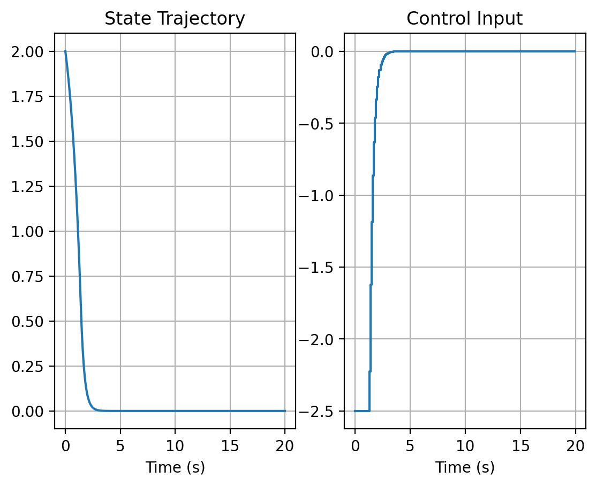
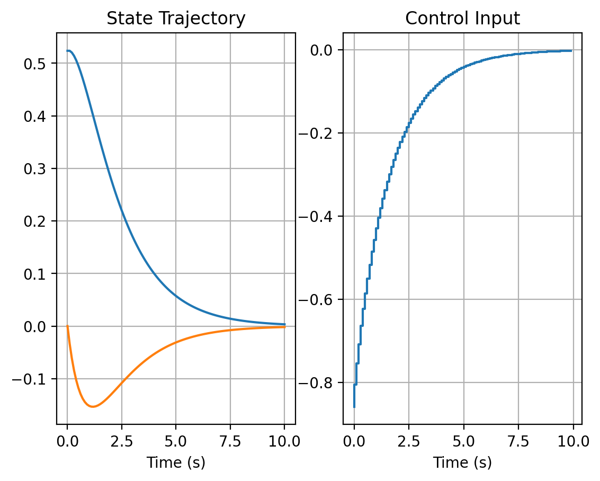
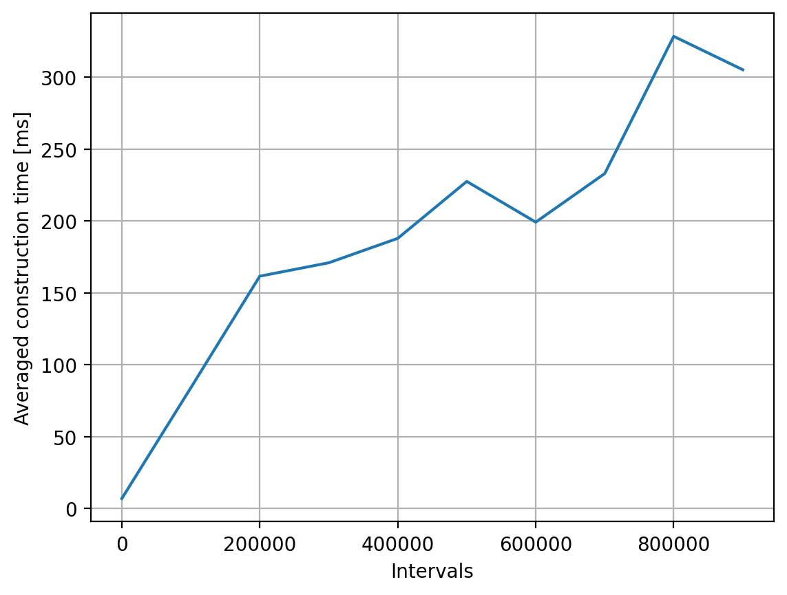

# Sparse Linear MPC

A Python implementation for formulating and generating sparse Quadratic Programming (QP) matrices for discrete-time Linear Model Predictive Control (LMPC). Built with `pydantic` for strict validation and `scipy.sparse` for scalable, memory-efficient matrix assembly.

## Discrete LMPC Formulation

Consider a discrete-time linear time-invariant system:

$$ x_{k+1} = A x_k + B u_k $$

Given a prediction horizon $N$, state dimension $n_x$, and input dimension $n_u$, the LMPC solves the following optimal control problem at each time step:

$$ 
\begin{aligned}
\min_{x, u} \quad & \sum_{k=1}^{N} \frac{1}{2} \left( (x_k - x_{\text{ref},k})^T Q (x_k - x_{\text{ref},k}) + (u_k - u_{\text{ref},k})^T R (u_k - u_{\text{ref},k}) \right) \\
& + \frac{1}{2}(x_{N+1} - x_{\text{ref},N+1})^T Q_{\text{end}} (x_{N+1} - x_{\text{ref},N+1}) \\
\text{s.t.} \quad & x_1 = \bar{x}_0 \\
& x_{k+1} = A x_k + B u_k, \quad \forall k \in \{1, \dots, N\} \\
& x_{lb} \le x_k \le x_{ub}, \quad \forall k \in \{1, \dots, N+1\} \\
& u_{lb} \le u_k \le u_{ub}, \quad \forall k \in \{1, \dots, N\}
\end{aligned}
$$

where $\bar{x}_0$ is the measured initial state.

## QP matrices

Define the stacked decision vector as

$$
w =
\begin{bmatrix}
x_1 \\
x_2 \\
\vdots \\
x_{N+1} \\
u_1 \\
u_2 \\
\vdots \\
u_N
\end{bmatrix}
$$

The QP is

$$
\boxed{
\begin{aligned}
\min_w \quad &
\frac{1}{2}w^\top H_{\mathrm{qp}}w
+
c_{\mathrm{qp}}^\top w
\\
\text{s.t.}\quad &
A_{\mathrm{qp}}w=b_{\mathrm{qp}},
\\
&
w_{\mathrm{lb}}\leq w\leq w_{\mathrm{ub}}.
\end{aligned}
}
$$

### Hessian matrix

The quadratic cost matrix is

$$
H_{\mathrm{QP}} = 
\begin{bmatrix}
I_N \otimes Q & 0 & 0 \\
0 & Q_{\mathrm{end}} & 0 \\
0 & 0 & I_N \otimes R
\end{bmatrix}
$$

### Linear cost vector

Define the stacked reference trajectories

$$
\bar{x}^{\mathrm{ref}} = 
\begin{bmatrix}
x_1^{\mathrm{ref}} \\
\vdots \\
x_n^{\mathrm{ref}}
\end{bmatrix},
\qquad
\bar{u}^{\mathrm{ref}} = 
\begin{bmatrix}
u_1^{\mathrm{ref}} \\
\vdots \\
u_n^{\mathrm{ref}}
\end{bmatrix}
$$

Then

$$
c_{\mathrm{QP}} = -
\begin{bmatrix}
(I_N \otimes Q) \bar{x}^{\mathrm{ref}} \\
Q_{\mathrm{end}} x_{N+1}^{\mathrm{ref}} \\
(I_N \otimes R) \bar{u}^{\mathrm{ref}}
\end{bmatrix}
$$

### Equality constraint matrix

Let 

$$
S_n \in \mathbb{R}^{(N+1) \times (N+1)}
$$ 

denote the lower-shift matrix,

$$
S_N = 
\begin{bmatrix}
0 & 0 & \cdots & 0 & 0 \\
1 & 0 & \cdots & 0 & 0 \\
0 & 1 & \cdots & 0 & 0 \\
\vdots & \vdots & \ddots & \vdots & \vdots \\
0 & 0 & \cdots & 1 & 0
\end{bmatrix}
$$

where $e_k$ is the $k$-th canonical basis vector.

Then the state-dynamics matrix is

$$
C_x = I_{N+1} \otimes I_{n_x} - S_N \otimes A
$$

$$
C_x = 
\begin{bmatrix}
I & 0 & 0 & \cdots & 0 \\
-A & I & 0 & \cdots & 0 \\
0 & -A & I & \cdots & 0 \\
\vdots & \ddots & \ddots & \ddots & \vdots \\
0 & \cdots & 0 & -A & I
\end{bmatrix}
$$

The input matrix is

$$
C_u = 
\begin{bmatrix}
0_{n_x \times N n_u} \\
-I_N \otimes B
\end{bmatrix}
$$

$$
C_u = 
\begin{bmatrix}
0 & 0 & \cdots & 0 \\
-B & 0 & \cdots & 0 \\
0 & -B & \cdots & 0 \\
\vdots & \ddots & \ddots & \vdots \\
0 & \cdots & 0 & -B
\end{bmatrix}
$$

Hence,

$$
A_{\mathrm{QP}} = 
\begin{bmatrix}
C_x & C_u
\end{bmatrix}
$$

### Equality-constraint right-hand side

The initial condition is imposed through

$$
b_{\mathrm{QP}} = 
\begin{bmatrix}
x_0 \\
0_{N n_x \times 1}
\end{bmatrix}
$$

Thus the equality constraints compactly represent

$$
x_1 = x_0, \qquad x_{k+1} = A x_k + B u_k, \qquad k = 1, \dots, N.
$$

### Box constraints

Define

$$
\bar{x}_{\mathrm{lb}} = \mathbf{1}_{N+1} \otimes x_{\mathrm{lb}}, \qquad \bar{x}_{\mathrm{ub}} = \mathbf{1}_{N+1} \otimes x_{\mathrm{ub}},
$$

and

$$
\bar{u}_{\mathrm{lb}} = \mathbf{1}_N \otimes u_{\mathrm{lb}}, \qquad \bar{u}_{\mathrm{ub}} = \mathbf{1}_N \otimes u_{\mathrm{ub}}.
$$

Then

$$
w_{\mathrm{lb}} = 
\begin{bmatrix}
\bar{x}_{\mathrm{lb}} \\
\bar{u}_{\mathrm{lb}}
\end{bmatrix},
\qquad
w_{\mathrm{ub}} = 
\begin{bmatrix}
\bar{x}_{\mathrm{ub}} \\
\bar{u}_{\mathrm{ub}}
\end{bmatrix}
$$

### Requirements

1. numpy
2. scipy
3. qpsolver/any sparse QP solver
4. pydantic
5. matplotlib

### Example

#### Example 1 - SISO

```python
from lmpc import LinearMPC
from qpsolver import solve_qp
import matplotlib.pyplot as plt

#mpc parameters
nx = 1
nu = 1
dt=0.1
N = 25
x0=np.array([[2]])
#forward euler
A = np.array([[dt+1]])
B = np.array([[dt]])
Q = np.array([[10]])
R = np.array([[1]])
Qend = np.array([[100]])
x_ref = np.zeros((nx, N + 1))
u_ref = np.zeros((nu, N))
x_lb = np.array([[-5]])
x_ub = np.array([[5]])
u_lb = np.array([[-2.5]])
u_ub = np.array([[2.5]])
# plant dynamics
def simulate(x0,u):
  xnext=A@x0+B@u
  return xnext
# parse and solve
def solve_mpc(x0):
  mpc = LinearMPC(
      intervals=N,
      nx=nx,
      nu=nu,
      A=A,
      B=B,
      Q=Q,
      R=R,
      Qend=Qend,
      x0=x0,
      x_ref=x_ref,
      u_ref=u_ref,
      x_lb=x_lb,
      x_ub=x_ub,
      u_lb=u_lb,
      u_ub=u_ub,
  )
  qp = mpc.generate_QP()
  z = solve_qp(
      P=qp["H"],
      q=qp["c"],
      A=qp["A"],
      b=qp["b"],
      lb=qp["lb"],
      ub=qp["ub"],
      solver="clarabel",
      verbose=False,
  )
  # first control input
  return z[nx*(N+1):nx*(N+1)+nu]

#start simulation
X=[x0]
U=[]
nsim=200
for i in range(nsim):
  umpc=solve_mpc(X[-1])
  xnext=simulate(X[-1],umpc)+np.random.normal(0,0.0)
  X.append(xnext)
  U.append(umpc)
#plot simulation
xsim=np.hstack(X).ravel()
tsim=np.linspace(0,nsim*dt,nsim+1)
usim=np.hstack(U).ravel()
f,a=plt.subplots(1,2)
a[0].plot(tsim,xsim)
a[0].set_title("State Trajectory")
a[0].set_xlabel("Time (s)")
a[0].grid(True)
a[1].step(tsim[0:-1],usim)
a[1].set_title("Control Input")
a[1].set_xlabel("Time (s)")
a[1].grid(True)
```
<p align="center">
  
</p>

#### Example 2 - taken from [syscop](https://www.syscop.de/files/2023ss/MPC4RES/MPCforRES_Exercise3_sol.pdf) homework problem

<p align="center">
  
</p>

```python
import matplotlib.pyplot as plt
#!pip install qpsolvers
from qpsolvers import solve_qp
# Exercise 3 LMPC syscop 2023
#mpc parameters
nx = 2
nu = 1
dt=0.1
N = 10
x0=np.array([[np.pi/6],[0]])
#ZOH matrix eponential
A = np.array([[1,0.1],[0.1,0.99]])
B = np.array([[0],[0.1]])
Q = np.eye(nx)
R = np.eye(nu)
Qend = np.array([[12.25,1.8],[1.8,1.88]])
x_ref = np.zeros((nx, N + 1))
u_ref = np.zeros((nu, N))
x_lb = np.array([[-100],[-100]])
x_ub = np.array([[100],[100]])
u_lb = np.array([[-1]])
u_ub = np.array([[1]])
# plant dynamics
def simulate(x0,u):
  #xnext=x0+dt*np.vstack([x0[1],np.sin(x0[0])-0.1*x0[1]+u*np.cos(x0[1])])
  xnext=A@x0.reshape(nx,1)+B@u.reshape(nu,1)
  return xnext
# parse and solve
def solve_mpc(x0):
  mpc = LinearMPC(
      intervals=N,
      nx=nx,
      nu=nu,
      A=A,
      B=B,
      Q=Q,
      R=R,
      Qend=Qend,
      x0=x0,
      x_ref=x_ref,
      u_ref=u_ref,
      x_lb=x_lb,
      x_ub=x_ub,
      u_lb=u_lb,
      u_ub=u_ub,
  )
  qp = mpc.generate_QP()
  z = solve_qp(
      P=qp["H"],
      q=qp["c"],
      A=qp["A"],
      b=qp["b"],
      lb=qp["lb"],
      ub=qp["ub"],
      solver="clarabel",
      verbose=False,
  )
  # first control input
  return z[nx*(N+1):nx*(N+1)+nu]

#start simulation
X=[x0]
U=[]
nsim=100
for i in range(nsim):
  umpc=solve_mpc(X[-1])
  xnext=simulate(X[-1],umpc)+np.random.normal(0,0.0)
  X.append(xnext)
  U.append(umpc)
#plot simulation
xsim=np.hstack(X)
tsim=np.linspace(0,nsim*dt,nsim+1)
usim=np.hstack(U).ravel()
plt.rcParams['figure.dpi'] = 200
f,a=plt.subplots(1,2)
a[0].plot(tsim,xsim[0,:])
a[0].plot(tsim,xsim[1,:])
a[0].set_title("State Trajectory")
a[0].set_xlabel("Time (s)")
a[0].grid(True)
a[1].step(tsim[0:-1],usim)
a[1].set_title("Control Input")
a[1].set_xlabel("Time (s)")
a[1].grid(True)
```

### QP matrices construction benchmark

For a 12 state, 4 control quadcopter system, QP matrices can be generated within 0.5 seconds for upto a million intervals. For more details refer to
[benchmark.py](./benchmark.py)

<p align="center">
  
</p>


